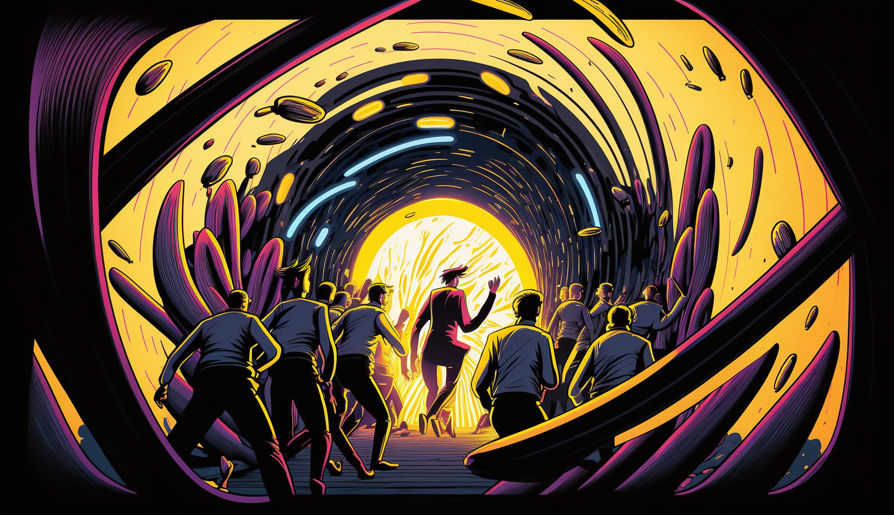

<p align="center"></p>
<p>
  <a href="https://azurlane.koumakan.jp/File:Minato_Aqua.png" style="color: gray; font-size: 10px;text-decoration: none">Illustration from Azur Lane Wiki</a>
</p>
<h1 align="center">Digital Descent: Managing the Agile Realm</h1>

<p align="center">
  <a href="https://github.com/Shirajuki/master-yey/blob/main/LICENSE" alt="LICENSE">
    
  </a>
  <a href="https://github.com/Shirajuki/master-yey/issues" alt="Issues">
    
  </a>
</p>

A Work In Progress Touhou, Azur Lane, Gundemonium Recollection and Harmful Park inspired danmaku JS horizontal scrolling 2D shooting game ⚓

- P2P for (proximity) chat
- Client-Server architecture
  - WebRTC / UDP for movement system
  - REST API endpoints w/ observables for server interaction

## Built With

- JavaScript / TypeScript
- Vite
- Express
- Geckos
- React
- SCSS

## Todos

See [issues](https://github.com/Shirajuki/master-yey/issues).

## Get started

Install the dependencies...

```bash
cd master-yey
cd client
yarn install
cd ..
cd server
yarn install
```

...then start the client and server:

```bash
cd client
yarn dev
```

```bash
cd server
yarn dev
```

Navigate to [localhost:5173](http://localhost:5173). You should see the game application running.

## Building and running in production mode

TBA...

## License

Distributed under the MIT License. See [`LICENSE`](./LICENSE) for more information.
